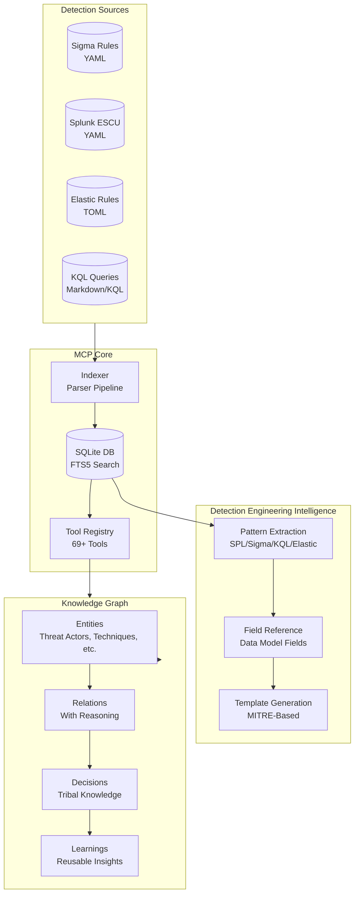
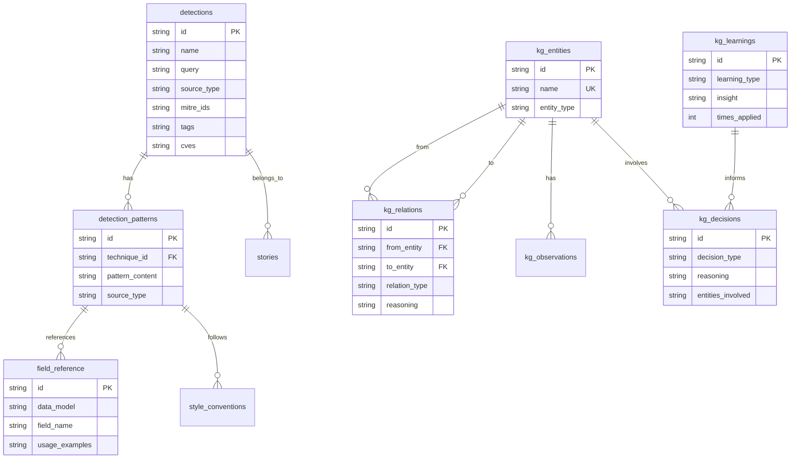
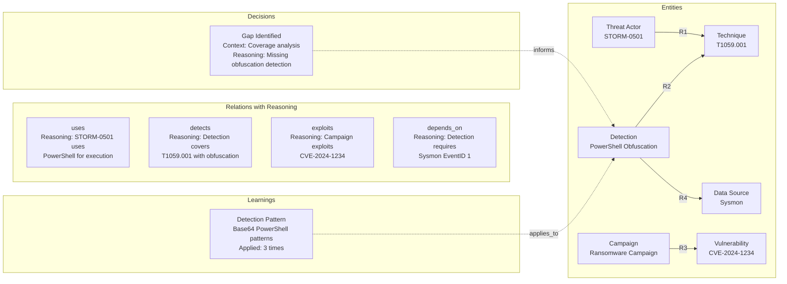
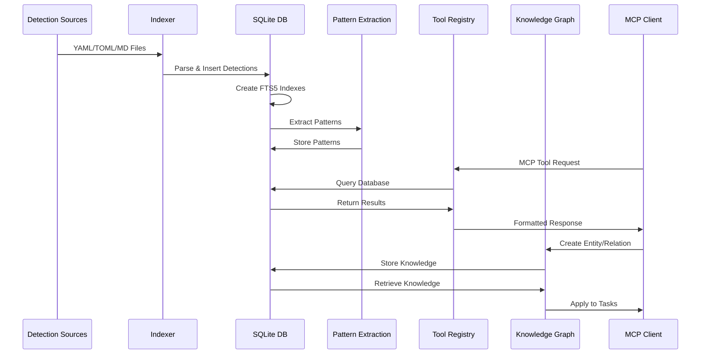
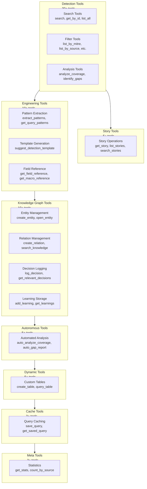

# Detections MCP Architecture Documentation

## Table of Contents

1. [System Overview](#system-overview)
2. [Database Schema](#database-schema)
3. [Pattern Extraction Pipeline](#pattern-extraction-pipeline)
4. [Knowledge Graph Structure](#knowledge-graph-structure)
5. [Data Flow](#data-flow)
6. [Tool Categories](#tool-categories)
7. [Performance](#performance)

---

## System Overview

The Detections MCP (Model Context Protocol) server is a comprehensive detection engineering intelligence system that indexes, analyzes, and provides intelligent access to security detection rules from multiple sources. The system enables detection engineers to search, compare, analyze coverage, extract patterns, and build tribal knowledge around security detections.

### Core Components

#### Input Sources

The system ingests detection rules from four primary sources:

- **Sigma Rules**: YAML-based detection rules using Sigma's standardized format
- **Splunk ESCU**: Splunk Enterprise Security Content Update detections in YAML format
- **Elastic Rules**: Elastic Security detection rules in TOML format
- **KQL Queries**: Kusto Query Language hunting queries from Azure Sentinel (markdown and raw .kql formats)

Each source is parsed by specialized parsers that normalize the detection data into a unified schema while preserving source-specific metadata.

#### Core Indexing and DB Layer

The system uses **SQLite** as its primary database engine, providing:

- **High Performance**: Sub-millisecond query times for indexed searches
- **Full-Text Search**: FTS5 virtual tables for fast semantic search across all detection fields
- **ACID Compliance**: Reliable data integrity for concurrent operations
- **Zero Configuration**: Single-file database with no external dependencies

The database layer consists of:

- **Core Detection Table**: Stores normalized detection metadata, queries, MITRE mappings, tags, and source information
- **Stories Table**: Stores analytic stories that group related detections
- **Pattern Tables**: Stores extracted query patterns, field references, and style conventions
- **Knowledge Graph Tables**: Stores entities, relations, decisions, observations, and learnings

#### Tool Registry

The system implements a **plugin-style tool registry** that allows modular tool registration. Tools are organized into categories:

- **Detection Tools**: Search, filter, and analyze detections (30+ tools)
- **Story Tools**: Manage and search analytic stories
- **Engineering Tools**: Pattern extraction, template generation, field references
- **Knowledge Graph Tools**: Entity/relation management, decision logging, learning storage
- **Autonomous Tools**: Automated analysis and gap identification
- **Dynamic Tools**: LLM-created tables for custom storage
- **Cache Tools**: Query result caching and template management
- **Meta Tools**: System statistics and health checks

All tools are registered with the central `ToolRegistry` singleton and exposed via the MCP protocol.

#### Detection Engineering Intelligence

The system extracts and learns from detection patterns to provide intelligent assistance:

- **Pattern Extraction**: Analyzes queries to extract SPL macros, Sigma fields, KQL functions, Elastic ECS fields, and data model usage
- **Field Reference**: Builds a reference of available fields per Splunk data model with usage examples
- **Template Generation**: Generates detection templates based on learned patterns for specific MITRE techniques
- **Style Conventions**: Learns naming conventions, macro usage patterns, and query structures

#### Knowledge Graph

The knowledge graph captures **tribal knowledge** - the reasoning and context behind analytical decisions:

- **Entities**: Threat actors, techniques, detections, campaigns, tools, vulnerabilities, data sources
- **Relations**: Typed connections between entities with reasoning explaining WHY they're connected
- **Decisions**: Recorded analytical decisions with full context and reasoning
- **Observations**: Facts about entities
- **Learnings**: Reusable patterns and insights that can be applied to future tasks



---

## Database Schema

The database schema is designed for high-performance queries, full-text search, and efficient pattern storage. All tables use SQLite's native types and leverage FTS5 for semantic search.

### Core Detection Table

The `detections` table stores normalized detection data:

```sql
CREATE TABLE detections (
  id TEXT PRIMARY KEY,                    -- UUID from source
  name TEXT NOT NULL,                     -- Detection name
  description TEXT,                      -- Full description
  query TEXT,                            -- Detection query (SPL/KQL/etc.)
  source_type TEXT NOT NULL,              -- sigma, splunk_escu, elastic, kql
  mitre_ids TEXT,                        -- JSON array of MITRE technique IDs
  logsource_category TEXT,               -- Sigma logsource category
  logsource_product TEXT,                 -- Sigma logsource product
  logsource_service TEXT,                 -- Sigma logsource service
  severity TEXT,                          -- Detection severity
  status TEXT,                            -- production, experimental, deprecated
  author TEXT,                            -- Author name
  date_created TEXT,                      -- Creation date
  date_modified TEXT,                     -- Last modification date
  refs TEXT,                              -- JSON array of references
  falsepositives TEXT,                    -- Known false positives
  tags TEXT,                              -- JSON object of tags
  file_path TEXT,                         -- Source file path
  raw_yaml TEXT,                          -- Original YAML/TOML content
  cves TEXT,                              -- JSON array of CVE IDs
  analytic_stories TEXT,                  -- JSON array of story names
  data_sources TEXT,                      -- JSON array of data source names
  detection_type TEXT,                     -- TTP, Anomaly, Baseline, Hunting, Correlation
  asset_type TEXT,                        -- JSON array of asset types
  security_domain TEXT,                    -- endpoint, network, threat, etc.
  process_names TEXT,                     -- JSON array of process names
  file_paths TEXT,                        -- JSON array of file paths
  registry_paths TEXT,                    -- JSON array of registry paths
  mitre_tactics TEXT,                     -- JSON array of MITRE tactics
  platforms TEXT,                         -- JSON array of platforms
  kql_category TEXT,                      -- KQL category
  kql_tags TEXT,                          -- JSON array of KQL tags
  kql_keywords TEXT                       -- JSON array of KQL keywords
)
```

**Indexes:**
- `idx_source_type` - Fast filtering by source
- `idx_severity` - Severity-based queries
- `idx_logsource_product` - Product filtering
- `idx_detection_type` - Type-based queries
- `idx_security_domain` - Domain filtering

**FTS5 Virtual Table:** `detections_fts` indexes all searchable fields for sub-millisecond full-text search.

### Pattern Tables

#### detection_patterns

Stores extracted query patterns organized by technique and source:

```sql
CREATE TABLE detection_patterns (
  id TEXT PRIMARY KEY,
  pattern_type TEXT NOT NULL,             -- spl_structure, sigma_structure, kql_structure, elastic_structure
  technique_id TEXT,                      -- MITRE technique ID (nullable)
  data_model TEXT,                        -- Splunk data model (nullable)
  source_type TEXT,                       -- Source type
  pattern_content TEXT NOT NULL,          -- JSON: PatternData structure
  example_detection_id TEXT,              -- Example detection using this pattern
  usage_count INTEGER DEFAULT 1,         -- How many detections use this pattern
  confidence REAL DEFAULT 1.0,             -- Pattern confidence score
  created_at TEXT DEFAULT CURRENT_TIMESTAMP
)
```

**PatternData Structure:**
```typescript
{
  uses_tstats: boolean,                    -- Uses tstats command
  uses_datamodel: string | null,          -- Data model used
  macros_used: string[],                  -- SPL macros extracted
  fields_used: string[],                  -- Fields referenced
  aggregations: string[],                  -- Aggregation functions
  where_patterns: string[],               -- WHERE clause patterns
  join_patterns: string[]                 -- JOIN patterns
}
```

#### field_reference

Stores field usage by Splunk data model:

```sql
CREATE TABLE field_reference (
  id TEXT PRIMARY KEY,
  data_model TEXT NOT NULL,               -- e.g., Endpoint.Processes
  field_name TEXT NOT NULL,               -- Field name
  field_type TEXT,                        -- Field data type
  common_values TEXT,                     -- JSON array of common values
  usage_examples TEXT,                    -- JSON array of detection names
  description TEXT,                       -- Field description
  usage_count INTEGER DEFAULT 1,         -- Usage frequency
  UNIQUE(data_model, field_name)
)
```

#### style_conventions

Stores learned style conventions:

```sql
CREATE TABLE style_conventions (
  id TEXT PRIMARY KEY,
  convention_type TEXT NOT NULL,          -- macro_usage, naming, etc.
  convention_key TEXT NOT NULL,           -- Convention identifier
  convention_value TEXT NOT NULL,        -- Convention value/pattern
  source TEXT DEFAULT 'extracted',       -- Source of convention
  confidence REAL DEFAULT 1.0,            -- Confidence score
  created_at TEXT DEFAULT CURRENT_TIMESTAMP,
  UNIQUE(convention_type, convention_key)
)
```

### Knowledge Graph Tables

#### kg_entities

Stores knowledge graph entities:

```sql
CREATE TABLE kg_entities (
  id TEXT PRIMARY KEY,
  name TEXT UNIQUE NOT NULL,              -- Entity name (e.g., "APT29", "T1059.001")
  entity_type TEXT NOT NULL,              -- threat_actor, technique, detection, campaign, tool, vulnerability, data_source
  created_at TEXT DEFAULT CURRENT_TIMESTAMP
)
```

**Entity Types:**
- `threat_actor` - APT groups, criminal gangs (e.g., "APT29", "STORM-0501")
- `technique` - MITRE ATT&CK techniques (e.g., "T1059.001 PowerShell")
- `detection` - Security detection rules
- `campaign` - Attack campaigns (e.g., "SolarWinds Compromise")
- `tool` - Attack tools or malware (e.g., "Cobalt Strike", "Mimikatz")
- `vulnerability` - CVEs (e.g., "CVE-2024-1234")
- `data_source` - Log sources (e.g., "Windows Security Events")

#### kg_relations

Stores typed relationships between entities with reasoning:

```sql
CREATE TABLE kg_relations (
  id TEXT PRIMARY KEY,
  from_entity TEXT NOT NULL,             -- Source entity name
  to_entity TEXT NOT NULL,                -- Target entity name
  relation_type TEXT NOT NULL,            -- Relation type
  reasoning TEXT,                         -- WHY this relation exists (tribal knowledge)
  confidence REAL DEFAULT 1.0,            -- Confidence score (0.0-1.0)
  created_at TEXT DEFAULT CURRENT_TIMESTAMP
)
```

**Relation Types:**
- `uses` - Threat actor uses technique/tool
- `targets` - Threat actor targets sector/system
- `detects` - Detection covers technique
- `covers` - Detection provides coverage for technique
- `mitigates` - Control mitigates technique
- `exploits` - Campaign exploits vulnerability
- `attributed_to` - Campaign attributed to threat actor
- `depends_on` - Detection depends on data source
- `related_to` - General relationship

#### kg_observations

Stores facts about entities:

```sql
CREATE TABLE kg_observations (
  id TEXT PRIMARY KEY,
  entity_name TEXT NOT NULL,              -- Entity this observation is about
  observation TEXT NOT NULL,               -- The observation/fact
  source TEXT,                            -- Source of observation
  confidence REAL DEFAULT 1.0,            -- Confidence score
  created_at TEXT DEFAULT CURRENT_TIMESTAMP
)
```

#### kg_decisions

Stores analytical decisions with full context (tribal knowledge):

```sql
CREATE TABLE kg_decisions (
  id TEXT PRIMARY KEY,
  decision_type TEXT NOT NULL,           -- Type of decision
  context TEXT NOT NULL,                  -- Situation that led to decision
  decision TEXT NOT NULL,                  -- The decision made
  reasoning TEXT NOT NULL,                -- WHY this decision was made (critical!)
  entities_involved TEXT,                 -- JSON array of entity names
  outcome TEXT,                           -- Result of decision
  session_id TEXT,                        -- Group related decisions
  created_at TEXT DEFAULT CURRENT_TIMESTAMP
)
```

**Decision Types:**
- `gap_identified` - Detection gap found
- `detection_recommended` - Specific detection recommended
- `coverage_mapped` - Coverage analyzed and mapped
- `priority_assigned` - Priority decision made
- `false_positive_tuning` - FP tuning recommendation
- `threat_assessment` - Threat level assessment
- `data_source_selected` - Data source chosen

#### kg_learnings

Stores reusable patterns and insights:

```sql
CREATE TABLE kg_learnings (
  id TEXT PRIMARY KEY,
  learning_type TEXT NOT NULL,            -- Type of learning
  title TEXT NOT NULL,                    -- Short title
  insight TEXT NOT NULL,                   -- The insight/pattern
  evidence TEXT,                           -- Evidence supporting learning
  applications TEXT,                       -- How to apply this learning
  times_applied INTEGER DEFAULT 0,        -- Usage counter
  created_at TEXT DEFAULT CURRENT_TIMESTAMP,
  last_applied TEXT                        -- Last application timestamp
)
```

**Learning Types:**
- `detection_pattern` - Pattern for writing effective detections
- `gap_pattern` - Recurring type of detection gap
- `user_preference` - User preferences for analysis style
- `false_positive_pattern` - Common FP patterns to avoid
- `threat_pattern` - Recurring threat behaviors
- `correlation_insight` - Insights about technique correlations
- `data_quality_insight` - Insights about data source quality

### FTS5 Full-Text Search Indexes

All knowledge graph tables have corresponding FTS5 virtual tables for fast semantic search:

- `kg_entities_fts` - Search entities by name and type
- `kg_relations_fts` - Search relations by reasoning and entity names
- `kg_observations_fts` - Search observations by content
- `kg_decisions_fts` - Search decisions by context, reasoning, and decision text
- `kg_learnings_fts` - Search learnings by insight, evidence, and applications

FTS5 triggers automatically keep virtual tables in sync with base tables.

### Database Schema Diagram



---

## Pattern Extraction Pipeline

The pattern extraction pipeline analyzes detection queries to extract reusable patterns, field usage, and style conventions. This enables intelligent template generation and field reference lookups.

### SPL Macro Extraction

For Splunk ESCU detections, the system extracts:

- **Macro Usage**: Identifies all macros used in queries (e.g., `sysmon`, `security_content_ctime`)
- **Data Model Usage**: Detects which Splunk data models are used (e.g., `Endpoint.Processes`, `Network_Traffic.All_Traffic`)
- **Field References**: Extracts fields referenced from data models (e.g., `Processes.process_name`, `Processes.dest`)
- **Aggregation Patterns**: Identifies common aggregation functions (`count`, `stats`, `values`, `dc`)
- **WHERE Clause Patterns**: Extracts filtering patterns (`IN`, `LIKE`, `EQUALS`, `WILDCARD`, `AND`, `OR`)

**Example Extraction:**
```spl
| tstats `security_content_summariesonly` count 
from datamodel=Endpoint.Processes 
where Processes.process_name="powershell.exe"
by Processes.dest Processes.user Processes.process
```

**Extracted Pattern:**
```json
{
  "uses_tstats": true,
  "uses_datamodel": "Endpoint.Processes",
  "macros_used": ["security_content_summariesonly"],
  "fields_used": ["process_name", "dest", "user", "process"],
  "aggregations": ["count"],
  "where_patterns": ["EQUALS"],
  "join_patterns": []
}
```

### Sigma Field Extraction

For Sigma rules, the system extracts:

- **Common Fields**: Identifies standard Sigma fields (`CommandLine`, `Image`, `ParentImage`, `User`, `TargetFilename`)
- **Condition Patterns**: Extracts Sigma condition operators (`AND`, `OR`, `NOT`, `CONTAINS`, `STARTSWITH`, `ENDSWITH`, `REGEX`)
- **Logsource Mapping**: Maps logsource categories/products to detection patterns

**Example Extraction:**
```yaml
detection:
  selection:
    CommandLine|contains: 'powershell'
    Image|endswith: '\powershell.exe'
  condition: selection
```

**Extracted Pattern:**
```json
{
  "uses_tstats": false,
  "uses_datamodel": null,
  "macros_used": [],
  "fields_used": ["CommandLine", "Image"],
  "aggregations": [],
  "where_patterns": ["CONTAINS", "ENDSWITH", "AND"],
  "join_patterns": []
}
```

### KQL Function Extraction

For KQL queries, the system extracts:

- **KQL Functions**: Identifies KQL-specific functions (`where`, `project`, `extend`, `summarize`, `join`, `union`)
- **Field Usage**: Extracts Azure Sentinel/Log Analytics fields (`TimeGenerated`, `Computer`, `ProcessName`, `CommandLine`)
- **Operators**: Extracts KQL operators (`has`, `contains`, `startswith`, `endswith`, `matches regex`, `in`)
- **Aggregations**: Identifies KQL aggregation functions (`count`, `dcount`, `sum`, `avg`, `make-set`)

**Example Extraction:**
```kql
SecurityEvent
| where EventID == 4688
| where CommandLine contains "powershell"
| summarize count() by Computer, Account
```

**Extracted Pattern:**
```json
{
  "uses_tstats": false,
  "uses_datamodel": null,
  "macros_used": [],
  "fields_used": ["EventID", "CommandLine", "Computer", "Account"],
  "aggregations": ["count", "summarize"],
  "where_patterns": ["EQUALS", "CONTAINS"],
  "join_patterns": []
}
```

### Elastic ECS Field Extraction

For Elastic rules, the system extracts:

- **ECS Fields**: Identifies Elastic Common Schema fields (`process.name`, `process.command_line`, `file.path`, `user.name`)
- **EQL Patterns**: Extracts Event Query Language patterns (`sequence`, `by`, `maxspan`, `until`)
- **Operators**: Extracts Elastic operators (`AND`, `OR`, `NOT`, `WILDCARD`, `FUZZY`, `RANGE`)

**Example Extraction:**
```toml
query = '''
process where process.name == "powershell.exe" and
  process.command_line contains "-nop -w hidden"
'''
```

**Extracted Pattern:**
```json
{
  "uses_tstats": false,
  "uses_datamodel": null,
  "macros_used": [],
  "fields_used": ["process.name", "process.command_line"],
  "aggregations": [],
  "where_patterns": ["EQUALS", "CONTAINS", "AND"],
  "join_patterns": []
}
```

### Data Model Normalization

The system normalizes Splunk data model names to full format:

- `Processes` → `Endpoint.Processes`
- `Filesystem` → `Endpoint.Filesystem`
- `Network_Traffic` → `Network_Traffic.All_Traffic`
- `Authentication` → `Authentication.Authentication`

This ensures consistent field reference lookups and pattern matching.

### Pattern Storage and Aggregation

Patterns are stored per technique and source type. When multiple detections use similar patterns, the system:

1. **Merges Patterns**: Combines macros, fields, and aggregations from multiple detections
2. **Tracks Usage**: Increments `usage_count` to identify most common patterns
3. **Preserves Examples**: Stores example detection IDs for reference
4. **Calculates Confidence**: Uses usage frequency to calculate pattern confidence

This enables the system to recommend the most common patterns when generating new detections for a specific MITRE technique.

---

## Knowledge Graph Structure

The knowledge graph captures **tribal knowledge** - the reasoning and context behind analytical decisions. Unlike traditional knowledge graphs that only store "what" is connected, this system stores "why" connections exist and "how" decisions were made.

### Entity Types

Entities represent discrete concepts in the security domain:

| Entity Type | Description | Examples |
|------------|-------------|----------|
| `threat_actor` | APT groups, criminal gangs | "APT29", "STORM-0501", "Lazarus" |
| `technique` | MITRE ATT&CK techniques | "T1059.001 PowerShell", "T1003.001 LSASS Memory" |
| `detection` | Security detection rules | "Suspicious PowerShell Execution", "LSASS Memory Dump" |
| `campaign` | Attack campaigns | "SolarWinds Compromise", "NotPetya" |
| `tool` | Attack tools or malware | "Cobalt Strike", "Mimikatz", "BloodHound" |
| `vulnerability` | CVEs | "CVE-2024-1234", "CVE-2021-44228" |
| `data_source` | Log sources | "Windows Security Events", "Sysmon", "CloudTrail" |

### Relation Types with Reasoning

Relations connect entities with typed edges and **required reasoning** explaining why the connection exists:

| Relation Type | Description | Example |
|--------------|-------------|---------|
| `uses` | Threat actor uses technique/tool | APT29 uses Cobalt Strike |
| `targets` | Threat actor targets sector/system | STORM-0501 targets healthcare |
| `detects` | Detection covers technique | "Suspicious PowerShell" detects T1059.001 |
| `covers` | Detection provides coverage | Detection covers T1059.001 with high confidence |
| `mitigates` | Control mitigates technique | MFA mitigates credential theft |
| `exploits` | Campaign exploits vulnerability | Campaign exploits CVE-2021-44228 |
| `attributed_to` | Campaign attributed to threat actor | Campaign attributed to APT29 |
| `depends_on` | Detection depends on data source | Detection depends on Sysmon EventID 1 |
| `related_to` | General relationship | Tool related to technique |

**Critical Feature**: Every relation **must** include a `reasoning` field explaining WHY the connection exists. This captures tribal knowledge that would otherwise be lost.

**Example Relation:**
```json
{
  "from_entity": "APT29",
  "to_entity": "Cobalt Strike",
  "relation_type": "uses",
  "reasoning": "APT29 consistently uses Cobalt Strike for C2 and lateral movement in their campaigns. Observed in multiple incident reports from 2020-2024.",
  "confidence": 0.95
}
```

### Decision Logging with Context

Decisions capture analytical reasoning with full context:

**Example Decision:**
```json
{
  "decision_type": "gap_identified",
  "context": "Analyzing STORM-0501 ransomware campaign coverage",
  "decision": "Identified gap: No detection for T1059.001 PowerShell execution with specific obfuscation patterns used by STORM-0501",
  "reasoning": "STORM-0501 uses base64-encoded PowerShell commands with specific patterns. Existing T1059.001 detections focus on generic PowerShell execution but don't catch the obfuscation techniques. Need detection that looks for base64 patterns combined with suspicious parent processes.",
  "entities_involved": ["STORM-0501", "T1059.001", "PowerShell"],
  "outcome": "Created new detection: detect_storm0501_powershell_obfuscation"
}
```

This allows future analysis sessions to understand:
- **What** decision was made
- **Why** it was made
- **What context** led to the decision
- **What entities** were involved
- **What outcome** resulted

### Learning Storage and Reuse

Learnings capture reusable patterns and insights:

**Example Learning:**
```json
{
  "learning_type": "detection_pattern",
  "title": "STORM-0501 PowerShell Obfuscation Pattern",
  "insight": "STORM-0501 consistently uses base64-encoded PowerShell commands with specific parent process patterns. Detections for T1059.001 should include base64 pattern matching combined with parent process filtering.",
  "evidence": "Observed in 5+ STORM-0501 incidents. Pattern consistent across campaigns.",
  "applications": "When creating T1059.001 detections for ransomware campaigns, include base64 pattern detection. Filter by suspicious parent processes like mshta.exe, wscript.exe.",
  "times_applied": 3
}
```

Learnings can be:
- **Searched** using FTS5 for relevant insights
- **Applied** to new detection creation tasks
- **Tracked** with usage counters to identify most valuable insights
- **Reused** across multiple analysis sessions

### Knowledge Graph Visualization



---

## Data Flow

Data flows through the system in several stages:

### 1. Indexing Phase

```
Source Files (YAML/TOML/MD)
    ↓
Parser Pipeline
    ├─ parseSigmaFile()
    ├─ parseSplunkFile()
    ├─ parseElasticFile()
    ├─ parseKqlFile()
    └─ parseStoryFile()
    ↓
Normalized Detection Objects
    ↓
Database Insertion
    ├─ insertDetection()
    ├─ insertStory()
    └─ FTS5 Index Update (automatic)
    ↓
Indexed Database
```

### 2. Pattern Extraction Phase

```
Indexed Detections
    ↓
Pattern Extraction
    ├─ extractSPLPatterns()
    ├─ extractSigmaPatterns()
    ├─ extractKQLPatterns()
    ├─ extractElasticPatterns()
    ├─ extractFieldUsage()
    ├─ extractMacroUsage()
    └─ extractNamingConventions()
    ↓
Pattern Storage
    ├─ detection_patterns table
    ├─ field_reference table
    └─ style_conventions table
```

### 3. Query Phase

```
MCP Tool Request
    ↓
Tool Registry
    ├─ Detection Tools (search, filter, analyze)
    ├─ Engineering Tools (patterns, templates)
    ├─ Knowledge Tools (entities, relations)
    └─ Autonomous Tools (gap analysis)
    ↓
Database Query
    ├─ SQL queries (filtered searches)
    ├─ FTS5 queries (full-text search)
    └─ Graph queries (knowledge traversal)
    ↓
Result Formatting
    ↓
MCP Response
```

### 4. Knowledge Graph Phase

```
Analytical Decision
    ↓
Knowledge Capture
    ├─ createEntity() - Create entities
    ├─ createRelation() - Link entities with reasoning
    ├─ logDecision() - Record decision context
    └─ addLearning() - Store reusable insights
    ↓
Knowledge Storage
    ├─ kg_entities table
    ├─ kg_relations table
    ├─ kg_decisions table
    └─ kg_learnings table
    ↓
Knowledge Retrieval
    ├─ searchKnowledge() - FTS5 search
    ├─ getRelevantDecisions() - Context-aware retrieval
    └─ getRelevantLearnings() - Pattern matching
    ↓
Applied to Future Tasks
```

### Data Flow Diagram



---

## Tool Categories

The system provides **69+ tools** organized into 8 categories:

### 1. Detection Search & Filters (30+ tools)

**Search Tools:**
- `search` - Full-text search across all detection fields
- `get_by_id` - Get detection by UUID
- `list_all` - List all detections with pagination

**Filter Tools:**
- `list_by_source` - Filter by source type (sigma, splunk_escu, elastic, kql)
- `list_by_mitre` - Filter by MITRE technique ID
- `list_by_mitre_tactic` - Filter by MITRE tactic
- `list_by_severity` - Filter by severity
- `list_by_detection_type` - Filter by type (TTP, Anomaly, etc.)
- `list_by_data_source` - Filter by data source
- `list_by_analytic_story` - Filter by analytic story
- `list_by_cve` - Filter by CVE ID
- `list_by_logsource` - Filter by Sigma logsource
- `list_by_process_name` - Filter by process name
- `list_by_name_pattern` - Filter by name pattern

**Analysis Tools:**
- `analyze_coverage` - Analyze MITRE coverage
- `identify_gaps` - Identify detection gaps
- `suggest_detections` - Suggest detections for gaps
- `smart_compare` - Compare detection sources
- `compare_sources` - Compare source coverage
- `get_coverage_summary` - Get coverage statistics
- `get_top_gaps` - Get top coverage gaps
- `get_technique_count` - Count detections per technique
- `get_technique_ids` - List all MITRE techniques covered

### 2. Story Tools (5+ tools)

- `get_story` - Get analytic story by ID
- `list_stories` - List all stories
- `list_stories_by_category` - Filter stories by category
- `search_stories` - Full-text search stories

### 3. Engineering Tools (10+ tools)

**Pattern Tools:**
- `extract_patterns` - Extract patterns from all detections
- `get_query_patterns` - Get patterns for a MITRE technique
- `get_field_reference` - Get fields for a data model
- `get_macro_reference` - Get common macros
- `suggest_detection_template` - Generate detection template
- `find_similar_detections` - Find similar detections
- `generate_rba_structure` - Generate RBA structure

### 4. Knowledge Graph Tools (10+ tools)

**Entity Management:**
- `create_entity` - Create knowledge entity
- `delete_entity` - Delete entity
- `open_entity` - Get entity details
- `read_graph` - Read knowledge graph

**Relation Management:**
- `create_relation` - Create relation with reasoning
- `search_knowledge` - Search knowledge graph

**Decision & Learning:**
- `log_decision` - Log analytical decision
- `get_relevant_decisions` - Get relevant decisions
- `add_learning` - Add reusable learning
- `get_learnings` - Get learnings
- `add_observation` - Add observation about entity
- `delete_observation` - Delete observation

### 5. Autonomous Tools (5+ tools)

- `auto_analyze_coverage` - Automated coverage analysis
- `auto_gap_report` - Automated gap report generation
- `auto_compare_sources` - Automated source comparison

### 6. Dynamic Tools (5+ tools)

- `create_table` - Create custom table
- `insert_row` - Insert row into custom table
- `query_table` - Query custom table
- `list_tables` - List all custom tables
- `describe_table` - Describe table schema
- `drop_table` - Drop custom table

### 7. Cache Tools (3+ tools)

- `save_query` - Save query result
- `get_saved_query` - Get saved query
- `list_saved_queries` - List saved queries

### 8. Meta Tools (3+ tools)

- `get_stats` - Get system statistics
- `get_detection_list` - Get detection list summary
- `count_by_source` - Count detections by source

### Tool Categories Diagram



---

## Performance

The system is optimized for high-performance queries and sub-millisecond search times:

### Database Performance

- **SQLite**: Single-file database with no external dependencies
- **FTS5 Virtual Tables**: Full-text search indexes for semantic search
- **Strategic Indexes**: B-tree indexes on frequently queried fields
- **Query Optimization**: Prepared statements for parameterized queries

### Search Performance

- **Sub-millisecond Searches**: FTS5 enables fast full-text search across 7,000+ detections
- **Indexed Filters**: Source type, severity, MITRE ID filters use indexed columns
- **Pagination**: Large result sets are paginated to limit memory usage

### Pattern Extraction Performance

- **Batch Processing**: Patterns extracted in batches during indexing
- **Incremental Updates**: New patterns merged with existing patterns
- **Lazy Loading**: Pattern tables created on-demand

### Knowledge Graph Performance

- **FTS5 Search**: All knowledge graph tables have FTS5 indexes
- **Graph Traversal**: Efficient queries for entity relations
- **Caching**: Frequently accessed entities cached in memory

### Scalability

- **7,000+ Detections**: System handles large detection repositories
- **Multiple Sources**: Supports 4+ detection source formats
- **Concurrent Access**: SQLite handles concurrent read operations efficiently
- **Memory Efficient**: Streaming parsers minimize memory usage during indexing

### Performance Metrics

- **Indexing**: ~100-500 detections/second (depends on file size)
- **Search**: <1ms for indexed searches, <10ms for FTS5 searches
- **Pattern Extraction**: ~50-100 patterns/second
- **Knowledge Graph Queries**: <5ms for entity lookups, <20ms for graph traversal

---

## Conclusion

The Detections MCP architecture provides a comprehensive, high-performance system for detection engineering intelligence. By combining SQLite's reliability, FTS5's search capabilities, and a knowledge graph for tribal knowledge, the system enables detection engineers to:

- **Search** thousands of detections instantly
- **Extract** patterns and learn from existing detections
- **Generate** templates based on learned patterns
- **Capture** tribal knowledge for future reference
- **Analyze** coverage and identify gaps
- **Compare** detection sources and techniques

The modular tool registry architecture allows easy extension with new tools and capabilities, while the knowledge graph ensures that analytical reasoning is preserved and reusable across sessions.
