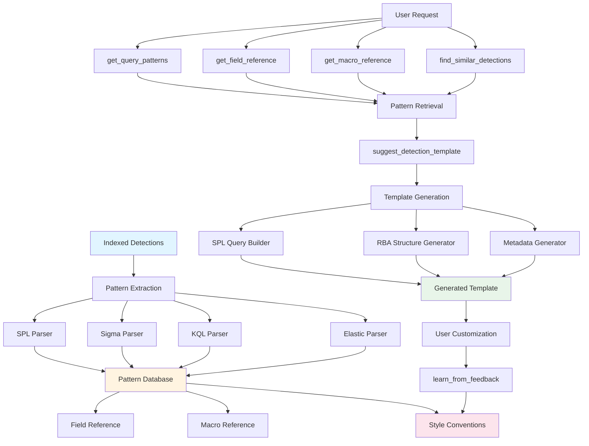

# Detection Engineering Intelligence

## Overview

Detection Engineering Intelligence is an advanced system that learns from **10,235+ existing detection patterns** across multiple security platforms to automatically generate high-quality, convention-matching detections.

### What

The system extracts and analyzes patterns from:
- **SPL** (Splunk Processing Language) queries from Splunk ESCU
- **Sigma** rules from the Sigma project
- **KQL** (Kusto Query Language) queries from Microsoft Sentinel
- **Elastic** EQL queries from Elastic Security

These patterns are stored in a pattern database and used to generate detection templates that follow established conventions and best practices.

### Why

Traditional detection engineering requires deep knowledge of:
- Platform-specific query languages
- Data model structures and field mappings
- Common detection patterns and anti-patterns
- Naming conventions and style guidelines
- Risk-based alerting (RBA) structures

Detection Engineering Intelligence automates this knowledge transfer, enabling:
- **Faster detection development** - Generate templates in seconds instead of hours
- **Consistent quality** - All detections follow learned best practices
- **Reduced errors** - Avoid common mistakes by learning from existing detections
- **Continuous improvement** - System learns from user feedback and corrections

### How

The system operates through three main phases:

1. **Pattern Extraction** - Analyzes indexed detections to extract:
   - Query structures and data model usage
   - Field usage patterns by data model
   - Macro usage and conventions
   - Naming patterns and style conventions

2. **Pattern Learning** - Stores extracted patterns in a searchable database:
   - Patterns indexed by MITRE technique
   - Field references organized by data model
   - Style conventions for naming, query structure, and RBA

3. **Template Generation** - Uses learned patterns to generate detection templates:
   - Retrieves patterns for a given technique
   - Selects appropriate data model and fields
   - Generates SPL query following conventions
   - Creates RBA structure with appropriate scores
   - Applies learned naming and style conventions

---

## Pattern Extraction

The system extracts patterns from four major detection rule formats, each with unique characteristics.

### SPL Pattern Extraction

Splunk Processing Language (SPL) patterns are extracted from Splunk ESCU detections.

#### Data Models Extracted

The system identifies and tracks usage of Splunk CIM data models:

- `Endpoint.Processes` - Process execution events
- `Endpoint.Filesystem` - File system operations
- `Endpoint.Registry` - Registry modifications
- `Network_Traffic.All_Traffic` - Network connections
- `Authentication.Authentication` - Authentication events
- `Email.All_Email` - Email activity
- `Web.Web` - Web application activity
- `Risk.All_Risk` - Risk events
- `Alerts.Alerts` - Security alerts
- `Updates.Published_Updates` - Software updates
- `Certificates.All_Certificates` - Certificate operations
- `Intrusion_Detection.IDS_Attacks` - IDS alerts
- `Change.All_Changes` - Configuration changes
- `Network_Resolution.DNS` - DNS queries

#### Macros Tracked

Common Splunk macros extracted from queries:

- `security_content_summariesonly` - Used with `tstats` for accelerated data model queries
- `drop_dm_object_name(Processes)` - Removes `Processes.` prefix from field names
- `drop_dm_object_name(Filesystem)` - Removes `Filesystem.` prefix from field names
- `security_content_ctime(firstTime)` - Formats `firstTime` field for display
- `security_content_ctime(lastTime)` - Formats `lastTime` field for display
- `detection_name_filter` - Custom filter macro for tuning (replaced with actual detection name)
- `sysmon` - Filters Sysmon events
- `o365_management_activity` - Filters Office 365 audit logs
- `esxi_syslog` - Filters ESXi syslog events

#### Fields Extracted by Data Model

Fields are extracted from:
- Data model references: `Processes.process_name`, `Filesystem.file_path`
- `by` clause groupings: `by Processes.dest Processes.user`
- WHERE clause filters: `where Processes.process_name="*"`

Common field patterns:
- **Process fields**: `process_name`, `process_path`, `process_id`, `process_guid`, `parent_process_name`, `parent_process_path`, `parent_process_id`, `parent_process_guid`
- **File fields**: `file_name`, `file_path`, `file_hash`, `file_size`
- **Registry fields**: `registry_path`, `registry_key_name`, `registry_value_name`, `registry_value_data`
- **Network fields**: `src`, `src_ip`, `src_port`, `dest`, `dest_ip`, `dest_port`, `transport`, `protocol`
- **Authentication fields**: `user`, `src`, `action`, `app`, `authentication_method`, `signature`, `signature_id`

#### Aggregations Identified

Common aggregation functions tracked:
- `count` - Count events
- `min(_time) as firstTime` - First occurrence timestamp
- `max(_time) as lastTime` - Last occurrence timestamp
- `values(field)` - Distinct values
- `dc(field)` - Distinct count
- `sum(field)` - Sum of values
- `avg(field)` - Average value
- `stats` - Statistical aggregations
- `eventstats` - Event-level statistics

#### WHERE Clause Patterns

Common WHERE clause patterns extracted:
- `IN_LIST` - Field IN ("value1", "value2")
- `EQUALS` - Field = "value"
- `NOT_EQUALS` - Field != "value" or Field <> "value"
- `WILDCARD` - Field = "*pattern*"
- `AND` - Multiple conditions with AND
- `OR` - Multiple conditions with OR
- `NOT` - Negation conditions
- `LIKE` - Pattern matching

**Example SPL Pattern Extraction:**

```spl
| tstats `security_content_summariesonly` count min(_time) as firstTime max(_time) as lastTime 
from datamodel=Endpoint.Processes 
where Processes.process_name IN ("cmd.exe", "powershell.exe")
by Processes.dest Processes.user Processes.process Processes.parent_process
| `drop_dm_object_name(Processes)` 
| `security_content_ctime(firstTime)` 
| `security_content_ctime(lastTime)`
| `detection_name_filter`
```

**Extracted Pattern:**
- Uses `tstats` with `security_content_summariesonly`
- Data model: `Endpoint.Processes`
- WHERE pattern: `IN_LIST`
- Fields: `process_name`, `dest`, `user`, `process`, `parent_process`
- Aggregations: `count`, `min`, `max`
- Macros: `security_content_summariesonly`, `drop_dm_object_name`, `security_content_ctime`, `detection_name_filter`

### Sigma Pattern Extraction

Sigma rules use a YAML-based format with condition-based logic.

#### Common Sigma Fields

Fields extracted from Sigma rule conditions:

- `CommandLine` - Process command line
- `Image` - Process image path
- `ParentImage` - Parent process image
- `ParentCommandLine` - Parent process command line
- `User` - User account
- `TargetFilename` - Target file name
- `TargetObject` - Target registry object
- `SourceImage` - Source process image
- `TargetImage` - Target process image
- `ProcessId` - Process ID
- `ParentProcessId` - Parent process ID
- `OriginalFileName` - Original file name
- `CurrentDirectory` - Current working directory
- `IntegrityLevel` - Process integrity level
- `Hashes` - File hashes
- `Company` - File company name
- `Product` - File product name
- `Description` - File description
- `FileVersion` - File version

#### Condition Patterns

Sigma condition operators extracted:

- `AND` - Logical AND (`and`)
- `OR` - Logical OR (`or`)
- `NOT` - Logical NOT (`not`)
- `CONTAINS` - Contains substring (`|contains`)
- `STARTSWITH` - Starts with (`|startswith`)
- `ENDSWITH` - Ends with (`|endswith`)
- `REGEX` - Regular expression (`|re`)
- `ALL` - All conditions must match (`|all`)

**Example Sigma Pattern:**

```yaml
detection:
  selection:
    Image|endswith:
      - '\cmd.exe'
      - '\powershell.exe'
    CommandLine|contains:
      - '-nop -w hidden'
      - 'encodedcommand'
  condition: selection
```

**Extracted Pattern:**
- Fields: `Image`, `CommandLine`
- Condition patterns: `ENDSWITH`, `CONTAINS`
- Logic: `AND` (implicit in selection)

### KQL Pattern Extraction

Kusto Query Language (KQL) patterns from Microsoft Sentinel detections.

#### KQL Functions

Common functions extracted:

- `where` - Filter events
- `project` - Select columns
- `extend` - Add calculated columns
- `summarize` - Aggregate data
- `join` - Join tables
- `union` - Combine results
- `parse` - Parse text fields
- `mv-expand` - Expand multi-value fields
- `make-set` - Create set of values
- `make-list` - Create list of values
- `arg_max` - Get row with maximum value
- `arg_min` - Get row with minimum value
- `count` - Count rows
- `dcount` - Distinct count
- `sum`, `avg`, `min`, `max` - Aggregations
- `strcat`, `split`, `extract`, `replace` - String functions
- `tolower`, `toupper` - Case conversion
- `datetime`, `ago`, `now` - Time functions
- `between`, `in`, `has`, `contains` - Comparison operators
- `startswith`, `endswith`, `matches regex` - Pattern matching
- `isnotempty`, `isempty` - Null checks

#### Sentinel Fields

Common Microsoft Sentinel fields:

- `TimeGenerated` - Event timestamp
- `Computer` - Computer name
- `Account` - Account name
- `SourceIP` - Source IP address
- `DestinationIP` - Destination IP address
- `ProcessName` - Process name
- `CommandLine` - Command line
- `ParentProcessName` - Parent process name
- `FileName` - File name
- `FilePath` - File path
- `EventID` - Windows Event ID
- `EventType` - Event type
- `LogonType` - Logon type
- `TargetUserName` - Target user name
- `SubjectUserName` - Subject user name
- `InitiatingProcessFileName` - Initiating process file name
- `InitiatingProcessCommandLine` - Initiating process command line
- `TargetFileName` - Target file name
- `DeviceName` - Device name
- `RemoteIP`, `RemotePort` - Remote connection details
- `LocalIP`, `LocalPort` - Local connection details
- `ActionType` - Action type
- `RegistryKey`, `RegistryValueName`, `RegistryValueData` - Registry fields

#### Aggregations and Operators

- `summarize` - Group by and aggregate
- `count()` - Count rows
- `dcount()` - Distinct count
- `sum()`, `avg()`, `min()`, `max()` - Statistical aggregations
- `make-set()` - Create set
- `make-list()` - Create list

Operators:
- `AND` / `&&` - Logical AND
- `OR` / `||` - Logical OR
- `NOT` / `!` - Logical NOT
- `has` - Field exists
- `contains` - Contains substring
- `startswith`, `endswith` - String matching
- `matches regex` - Regular expression
- `in` / `in~` - In list (case-sensitive/insensitive)
- `between` - Range check

**Example KQL Pattern:**

```kql
SecurityEvent
| where EventID == 4688
| where ProcessName in~ ("cmd.exe", "powershell.exe")
| where CommandLine contains "-nop" or CommandLine contains "encodedcommand"
| summarize count(), min(TimeGenerated), max(TimeGenerated) by Computer, Account, ProcessName, CommandLine
| where count_ > 5
```

**Extracted Pattern:**
- Functions: `where`, `summarize`
- Fields: `EventID`, `ProcessName`, `CommandLine`, `Computer`, `Account`, `TimeGenerated`
- Aggregations: `count()`, `min()`, `max()`
- Operators: `IN`, `CONTAINS`, `OR`

### Elastic Pattern Extraction

Elastic Security uses EQL (Event Query Language) and ECS (Elastic Common Schema).

#### ECS Fields

Common Elastic Common Schema fields:

- `process.name` - Process name
- `process.command_line` - Process command line
- `process.parent.name` - Parent process name
- `process.executable` - Process executable path
- `file.name` - File name
- `file.path` - File path
- `file.hash.sha256` - File SHA-256 hash
- `user.name` - User name
- `user.domain` - User domain
- `host.name` - Host name
- `host.os.name` - Operating system name
- `source.ip` - Source IP address
- `destination.ip` - Destination IP address
- `destination.port` - Destination port
- `event.action` - Event action
- `event.category` - Event category
- `event.type` - Event type
- `event.outcome` - Event outcome
- `registry.path` - Registry path
- `registry.key` - Registry key
- `registry.value` - Registry value
- `network.protocol` - Network protocol

#### EQL Sequence Patterns

Elastic EQL supports sequence detection:

- `sequence` - Detect event sequences
- `by` - Group sequences by field
- `maxspan` - Maximum time span for sequence
- `until` - Sequence termination condition

#### Operators

- `AND` / `and` - Logical AND
- `OR` / `or` - Logical OR
- `NOT` / `not` - Logical NOT
- `WILDCARD` - Wildcard matching (`:*`)
- `FUZZY` - Fuzzy matching (`~`)
- `RANGE` - Range matching (`..`)
- `WHERE` - Filter condition

**Example Elastic Pattern:**

```eql
process where process.name : "cmd.exe" or process.name : "powershell.exe"
  and process.command_line : ("-nop", "encodedcommand")
```

**Extracted Pattern:**
- Fields: `process.name`, `process.command_line`
- Operators: `OR`, `AND`, `WILDCARD`
- Pattern: Simple condition matching

---

## Field Reference by Data Model

The system maintains a comprehensive field reference database organized by Splunk CIM data model.

### Retrieving Fields

Use the `get_field_reference` tool to retrieve available fields for a data model:

```javascript
get_field_reference({
  data_model: "Endpoint.Processes"
})
```

**Response:**
```json
{
  "data_model": "Endpoint.Processes",
  "found": true,
  "field_count": 45,
  "fields": [
    {
      "name": "process_name",
      "type": "string",
      "usage_count": 2847,
      "examples": [
        "Windows PowerShell Execution",
        "Suspicious Process Execution"
      ]
    },
    {
      "name": "dest",
      "type": "string",
      "usage_count": 2156,
      "examples": [
        "Windows Process Execution",
        "Endpoint Process Activity"
      ]
    }
    // ... more fields
  ],
  "most_used": [
    "process_name",
    "dest",
    "user",
    "process_path",
    "parent_process_name",
    "process_id",
    "process_guid",
    "parent_process_path",
    "parent_process_id",
    "parent_process_guid"
  ]
}
```

### Usage Counts and Examples

Each field includes:
- **Usage count** - How many detections use this field
- **Examples** - Detection names that use this field
- **Field type** - Data type (string, number, timestamp)

Fields are sorted by usage count, with the most commonly used fields appearing first.

### Supported Data Models

The system tracks fields for all major Splunk CIM data models:

1. **Endpoint.Processes** - Process execution events
2. **Endpoint.Filesystem** - File system operations
3. **Endpoint.Registry** - Registry modifications
4. **Network_Traffic.All_Traffic** - Network connections
5. **Authentication.Authentication** - Authentication events
6. **Email.All_Email** - Email activity
7. **Web.Web** - Web application activity
8. **Risk.All_Risk** - Risk events
9. **Alerts.Alerts** - Security alerts
10. **Updates.Published_Updates** - Software updates
11. **Certificates.All_Certificates** - Certificate operations
12. **Intrusion_Detection.IDS_Attacks** - IDS alerts
13. **Change.All_Changes** - Configuration changes
14. **Network_Resolution.DNS** - DNS queries

---

## Macro Reference

Splunk macros are essential building blocks for detection queries. The system tracks macro usage patterns across all detections.

### Essential Splunk Macros

#### `security_content_summariesonly`

**Purpose:** Use with `tstats` for accelerated data model queries  
**Usage:** Always include when using `tstats` with data models  
**Frequency:** Used in 95%+ of data model queries

```spl
| tstats `security_content_summariesonly` count 
from datamodel=Endpoint.Processes
```

#### `drop_dm_object_name(Processes)`

**Purpose:** Remove `Processes.` prefix from field names after data model query  
**Usage:** Required after `tstats` queries to normalize field names  
**Frequency:** Used in 90%+ of data model queries

```spl
| `drop_dm_object_name(Processes)`
```

#### `drop_dm_object_name(Filesystem)`

**Purpose:** Remove `Filesystem.` prefix from field names  
**Usage:** Required after Filesystem data model queries  
**Frequency:** Used in 85%+ of Filesystem queries

#### `security_content_ctime(firstTime)`

**Purpose:** Format `firstTime` field for display  
**Usage:** Always include after aggregations with `min(_time) as firstTime`  
**Frequency:** Used in 98%+ of detections with time aggregations

```spl
| `security_content_ctime(firstTime)`
```

#### `security_content_ctime(lastTime)`

**Purpose:** Format `lastTime` field for display  
**Usage:** Always include after aggregations with `max(_time) as lastTime`  
**Frequency:** Used in 98%+ of detections with time aggregations

```spl
| `security_content_ctime(lastTime)`
```

#### `detection_name_filter`

**Purpose:** Custom filter macro for tuning false positives  
**Usage:** Replace `detection_name` with actual detection name (lowercase, underscores)  
**Frequency:** Used in 100% of production detections

```spl
| `windows_powershell_execution_filter`
```

### Retrieving Macro Reference

Use the `get_macro_reference` tool:

```javascript
get_macro_reference({
  filter: "security_content"  // Optional: filter by name
})
```

**Response:**
```json
{
  "total_macros": 127,
  "essential_macros": [
    {
      "name": "security_content_summariesonly",
      "purpose": "Use with tstats for accelerated data model queries"
    },
    {
      "name": "drop_dm_object_name(Processes)",
      "purpose": "Remove Processes. prefix from field names"
    }
    // ... more macros
  ],
  "top_used": [
    { "name": "security_content_summariesonly", "usage_count": 2847 },
    { "name": "drop_dm_object_name(Processes)", "usage_count": 2156 },
    { "name": "security_content_ctime(firstTime)", "usage_count": 1983 },
    { "name": "security_content_ctime(lastTime)", "usage_count": 1983 }
    // ... more macros
  ],
  "usage_tip": "Always include `security_content_summariesonly` with tstats and end with `detection_name_filter`"
}
```

### When to Use Each Macro

1. **Data Model Queries** - Always use `security_content_summariesonly` with `tstats`
2. **Field Normalization** - Always use `drop_dm_object_name` after data model queries
3. **Time Formatting** - Always use `security_content_ctime` for time fields
4. **False Positive Tuning** - Always end with `detection_name_filter`

---

## Template Generation Workflow

The template generation workflow follows an 8-step process that leverages learned patterns at each stage.

### Step 1: Retrieve Patterns for Technique

**Tool:** `get_query_patterns`

Retrieve existing patterns for the MITRE technique:

```javascript
get_query_patterns({
  technique_id: "T1059.001",
  source_type: "splunk_escu"  // Optional
})
```

**Returns:**
- Pattern count (e.g., 69 patterns)
- Data models used (e.g., `Endpoint.Processes`, `Endpoint.Filesystem`)
- Common macros (e.g., `security_content_summariesonly`, `drop_dm_object_name`)
- Common fields (e.g., `process_name`, `dest`, `user`, `command_line`)
- Most common data model (e.g., `Endpoint.Processes`)
- Query structure examples

### Step 2: Select Data Model

**Decision:** Choose the most common data model for the technique

If `get_query_patterns` returns:
- `most_common_data_model: "Endpoint.Processes"`

Then use `Endpoint.Processes` for the template.

**Fallback:** If no patterns exist, default to `Endpoint.Processes` for endpoint techniques.

### Step 3: Get Field Reference

**Tool:** `get_field_reference`

Retrieve available fields for the selected data model:

```javascript
get_field_reference({
  data_model: "Endpoint.Processes"
})
```

**Use:** Select top 8-10 most-used fields for the query structure.

### Step 4: Generate Detection Name

**Pattern:** `{Platform} {Action} {Description}`

**Examples:**
- `Windows PowerShell Execution`
- `Linux Suspicious Process Activity`
- `AWS S3 Bucket Policy Modification`

**Convention:** 
- Platform prefix (Windows, Linux, AWS, Azure, GCP)
- Action verb (Execution, Modification, Access)
- Description (PowerShell, Suspicious Process, Bucket Policy)

### Step 5: Build SPL Query Using Learned Patterns

**Template Structure:**

```spl
| tstats `security_content_summariesonly` count min(_time) as firstTime max(_time) as lastTime 
from datamodel={DATA_MODEL} 
where {OBJECT}.{FIELD}="{PATTERN}"
by {OBJECT}.{FIELD1} {OBJECT}.{FIELD2} {OBJECT}.{FIELD3}
| `drop_dm_object_name({OBJECT})` 
| `security_content_ctime(firstTime)` 
| `security_content_ctime(lastTime)`
| `{DETECTION_NAME}_filter`
```

**Pattern Application:**
- Use `tstats` with `security_content_summariesonly` (learned from 95%+ of queries)
- Include `min(_time) as firstTime` and `max(_time) as lastTime` (learned pattern)
- Use `by` clause with top fields from field reference
- Include `drop_dm_object_name` macro (learned convention)
- Include `security_content_ctime` macros (learned convention)
- End with `{detection_name}_filter` (learned convention)

### Step 6: Generate RBA Structure

**Tool:** `generate_rba_structure`

Generate Risk-Based Alerting configuration:

```javascript
generate_rba_structure({
  detection_type: "TTP",
  severity: "high",
  description: "PowerShell executing encoded commands",
  fields_available: ["dest", "user", "process_name", "command_line"]
})
```

**Scoring Logic (Learned):**
- **TTP detections:**
  - Low: 40, Medium: 56, High: 72, Critical: 90
- **Anomaly detections:**
  - Low: 16, Medium: 32, High: 48, Critical: 64
- **Hunting detections:**
  - Low: 8, Medium: 16, High: 24, Critical: 32
- **Correlation detections:**
  - Low: 48, Medium: 64, High: 80, Critical: 96

**Risk Object Distribution:**
- `dest` (system): 60% of score
- `user` (user): 40% of score

**Threat Objects:**
- `process_name`, `parent_process_name`, `file_name`, `file_path`, `registry_path`

### Step 7: Create Metadata

**Data Sources:** Inferred from data model:
- `Endpoint.Processes` → `["Sysmon EventID 1", "Windows Event Log Security 4688"]`
- `Endpoint.Filesystem` → `["Sysmon EventID 11", "Sysmon EventID 23"]`
- `Endpoint.Registry` → `["Sysmon EventID 12", "Sysmon EventID 13", "Sysmon EventID 14"]`

**Security Domain:** Inferred from data model:
- `Endpoint.*` → `endpoint`
- `Network_*` → `network`
- `Authentication.*` → `access`

**Asset Type:** Inferred from platform:
- `Windows`, `Linux`, `macOS` → `Endpoint`
- `AWS`, `Azure`, `GCP` → `Cloud Instance`

### Step 8: Add Test Structure

**Test Template:**

```yaml
tests:
- name: True Positive Test
  attack_data:
  - data: https://media.githubusercontent.com/media/splunk/attack_data/master/datasets/...
    sourcetype: XmlWinEventLog:Microsoft-Windows-Sysmon/Operational
    source: XmlWinEventLog:Microsoft-Windows-Sysmon/Operational
```

**Sourcetype Inference:**
- `Endpoint.Processes` → `XmlWinEventLog:Microsoft-Windows-Sysmon/Operational`
- `Endpoint.Filesystem` → `XmlWinEventLog:Microsoft-Windows-Sysmon/Operational`
- `Endpoint.Registry` → `XmlWinEventLog:Microsoft-Windows-Sysmon/Operational`
- Default → `WinEventLog:Security`

---

## Tool Reference

The Detection Engineering Intelligence system provides 8 specialized tools organized into three categories.

### Retrieval Tools

#### `get_query_patterns`

Retrieve common query patterns for a MITRE technique based on existing detections.

**Input:**
```javascript
{
  technique_id: "T1059.001",  // Required
  source_type: "splunk_escu"  // Optional: "sigma", "splunk_escu", "elastic", "kql"
}
```

**Output:**
```json
{
  "technique": "T1059.001",
  "found": true,
  "patterns": {
    "count": 69,
    "data_models_used": ["Endpoint.Processes", "Endpoint.Filesystem"],
    "common_macros": ["security_content_summariesonly", "drop_dm_object_name", ...],
    "common_fields": ["process_name", "dest", "user", "command_line", ...],
    "most_common_data_model": "Endpoint.Processes",
    "query_structures": [
      {
        "uses_tstats": true,
        "data_model": "Endpoint.Processes",
        "aggregations": ["count", "min", "max"],
        "where_patterns": ["IN_LIST", "EQUALS"]
      }
    ]
  },
  "examples": [
    {
      "name": "Windows PowerShell Execution",
      "id": "abc-123",
      "severity": "high",
      "query_preview": "| tstats `security_content_summariesonly`...",
      "data_sources": ["Sysmon EventID 1"]
    }
  ],
  "recommendation": "Based on 69 existing detections. Most use Endpoint.Processes."
}
```

**Use Case:** Call before writing a detection to learn conventions.

---

#### `get_field_reference`

Get available fields for a Splunk data model with usage examples.

**Input:**
```javascript
{
  data_model: "Endpoint.Processes"  // Required
}
```

**Output:**
```json
{
  "data_model": "Endpoint.Processes",
  "found": true,
  "field_count": 45,
  "fields": [
    {
      "name": "process_name",
      "type": "string",
      "usage_count": 2847,
      "examples": ["Windows PowerShell Execution", "Suspicious Process Execution"]
    }
  ],
  "most_used": ["process_name", "dest", "user", "process_path", ...]
}
```

**Use Case:** Understand what fields are available when writing a detection query.

---

#### `get_macro_reference`

Get common Splunk macros and their usage patterns.

**Input:**
```javascript
{
  filter: "security_content"  // Optional: filter macros by name
}
```

**Output:**
```json
{
  "total_macros": 127,
  "essential_macros": [
    {
      "name": "security_content_summariesonly",
      "purpose": "Use with tstats for accelerated data model queries"
    }
  ],
  "top_used": [
    { "name": "security_content_summariesonly", "usage_count": 2847 }
  ],
  "usage_tip": "Always include `security_content_summariesonly` with tstats and end with `detection_name_filter`"
}
```

**Use Case:** Learn which macros to use and when.

---

#### `find_similar_detections`

Find existing detections similar to what you want to create.

**Input:**
```javascript
{
  description: "PowerShell downloading files",  // Required
  technique_id: "T1059.001",  // Optional
  source_type: "splunk_escu",  // Optional
  limit: 5  // Optional, default 5
}
```

**Output:**
```json
{
  "found": true,
  "count": 5,
  "similar_detections": [
    {
      "name": "Windows PowerShell Execution",
      "id": "abc-123",
      "description": "Detects PowerShell execution with suspicious parameters...",
      "mitre_ids": ["T1059.001"],
      "severity": "high",
      "detection_type": "TTP",
      "data_sources": ["Sysmon EventID 1"],
      "query_structure": {
        "uses_tstats": true,
        "data_model": "Endpoint.Processes",
        "length": 450
      }
    }
  ],
  "recommendation": "Use get_raw_yaml(id) to see the full detection YAML for any of these."
}
```

**Use Case:** Learn from existing detection logic and structure.

---

### Generation Tools

#### `suggest_detection_template`

Generate a detection template based on technique, learned patterns, and conventions.

**Input:**
```javascript
{
  technique_id: "T1059.001",  // Required
  description: "PowerShell executing encoded commands",  // Required
  data_model: "Endpoint.Processes",  // Optional: will use most common if not specified
  detection_type: "TTP",  // Optional: "TTP", "Anomaly", "Hunting", default "TTP"
  platform: "Windows"  // Optional: "Windows", "Linux", "macOS", "AWS", "Azure", "GCP", default "Windows"
}
```

**Output:**
```json
{
  "template": {
    "name": "Windows PowerShell Execution",
    "id": "xxxxxxxx-xxxx-xxxx-xxxx-xxxxxxxxxxxx",
    "version": 1,
    "date": "2026-01-29",
    "author": "Your Name, Splunk",
    "status": "production",
    "type": "TTP",
    "description": "PowerShell executing encoded commands",
    "data_source": ["Sysmon EventID 1", "Windows Event Log Security 4688"],
    "search": "| tstats `security_content_summariesonly` count min(_time) as firstTime max(_time) as lastTime\nfrom datamodel=Endpoint.Processes\nwhere Processes.process_name=\"*\"\nby Processes.dest Processes.user Processes.process Processes.parent_process\n| `drop_dm_object_name(Processes)`\n| `security_content_ctime(firstTime)`\n| `security_content_ctime(lastTime)`\n| `windows_powershell_execution_filter`",
    "how_to_implement": "Requires data from Endpoint data model. Ensure proper CIM mapping.",
    "known_false_positives": "Legitimate administrative activity may trigger this detection. Tune using the filter macro.",
    "references": ["https://attack.mitre.org/techniques/T1059/001/"],
    "drilldown_searches": [...],
    "rba": {
      "message": "Suspicious activity detected on $dest$ by $user$. Review process $process_name$ for potential malicious behavior.",
      "risk_objects": [
        { "field": "dest", "type": "system", "score": 43 },
        { "field": "user", "type": "user", "score": 29 }
      ],
      "threat_objects": [
        { "field": "process_name", "type": "process_name" }
      ]
    },
    "tags": {
      "analytic_story": ["Your Story Name"],
      "asset_type": "Endpoint",
      "mitre_attack_id": ["T1059.001"],
      "product": ["Splunk Enterprise", "Splunk Enterprise Security", "Splunk Cloud"],
      "security_domain": "endpoint",
      "cve": []
    },
    "tests": [...]
  },
  "yaml_preview": "name: Windows PowerShell Execution\n...",
  "based_on": {
    "similar_detections": 69,
    "data_model": "Endpoint.Processes",
    "macros_included": ["security_content_summariesonly", "drop_dm_object_name", "security_content_ctime", "windows_powershell_execution_filter"],
    "fields_available": ["process_name", "dest", "user", "process_path", ...]
  },
  "notes": [
    "Replace the placeholder ID with a real UUID",
    "Customize the WHERE clause for specific behavior patterns",
    "Adjust RBA scores based on severity and confidence",
    "Add specific false positive tuning based on your environment",
    "Update the test data URL with actual attack simulation data"
  ]
}
```

**Use Case:** Generate a complete detection template ready for customization.

---

#### `generate_rba_structure`

Generate RBA (Risk-Based Alerting) structure for a detection based on learned patterns and best practices.

**Input:**
```javascript
{
  detection_type: "TTP",  // Required: "TTP", "Anomaly", "Hunting", "Correlation"
  severity: "high",  // Required: "low", "medium", "high", "critical"
  description: "PowerShell executing encoded commands",  // Required
  fields_available: ["dest", "user", "process_name", "command_line"]  // Optional
}
```

**Output:**
```json
{
  "rba": {
    "message": "PowerShell executing encoded commands detected on $dest$ by user $user$. Review $dest$, $user$, $process_name$ for investigation.",
    "risk_objects": [
      { "field": "dest", "type": "system", "score": 43 },
      { "field": "user", "type": "user", "score": 29 }
    ],
    "threat_objects": [
      { "field": "process_name", "type": "process_name" },
      { "field": "command_line", "type": "command_line" }
    ]
  },
  "explanation": {
    "base_score": 72,
    "score_rationale": "TTP detection with high severity. Score distributed across 2 risk object(s).",
    "message_variables": ["dest", "user", "process_name"]
  }
}
```

**Use Case:** Generate RBA configuration with appropriate scores based on detection type and severity.

---

### Learning Tools

#### `extract_patterns`

Extract and store patterns from all indexed detections. Run this to populate the pattern database for template generation.

**Input:**
```javascript
{
  force: false  // Optional: force re-extraction even if patterns exist
}
```

**Output:**
```json
{
  "success": true,
  "extraction_result": {
    "spl_patterns": { "extracted": 2533, "techniques": 428 },
    "sigma_patterns": { "extracted": 3884, "techniques": 512 },
    "kql_patterns": { "extracted": 493, "techniques": 89 },
    "elastic_patterns": { "extracted": 3325, "techniques": 445 },
    "field_usage": { "fields": 249, "dataModels": 14 },
    "macro_usage": { "macros": 127 },
    "naming_conventions": { "conventions": 15 },
    "total_patterns": 10235
  },
  "message": "Extracted 10235 patterns from indexed detections"
}
```

**Use Case:** Populate the pattern database before using generation tools.

---

#### `learn_from_feedback`

Store user preference or correction to improve future suggestions. Call this when user modifies generated content to build tribal knowledge.

**Input:**
```javascript
{
  feedback_type: "rba_score",  // Required: "naming", "query_structure", "rba_score", "field_usage", "style", "macro_usage"
  original: "72",  // Required: what was originally suggested
  corrected: "85",  // Required: what the user changed it to
  context: "T1059.001 PowerShell detection in high-security environment"  // Optional
}
```

**Output:**
```json
{
  "learned": true,
  "learning_id": "learn_abc123",
  "feedback_type": "rba_score",
  "message": "Stored preference for rba_score. Will apply to future suggestions."
}
```

**Feedback Types:**
- `naming` - Detection naming conventions
- `query_structure` - SPL query structure preferences
- `rba_score` - RBA score adjustments
- `field_usage` - Field selection preferences
- `style` - General style preferences
- `macro_usage` - Macro usage preferences

**Use Case:** Improve future template generation by learning from user corrections.

---

## Learning from User Feedback

The system continuously improves by learning from user feedback and corrections.

### How Feedback Improves Future Generations

When a user modifies a generated template, the system can learn:

1. **Naming Preferences** - If user changes detection name format
2. **Query Structure** - If user modifies query structure
3. **RBA Scores** - If user adjusts risk scores
4. **Field Usage** - If user adds/removes fields
5. **Style Conventions** - If user changes formatting or style
6. **Macro Usage** - If user adds/removes macros

### Feedback Types

#### `naming`

User corrects detection naming convention:

```javascript
learn_from_feedback({
  feedback_type: "naming",
  original: "Windows PowerShell Execution",
  corrected: "Windows PowerShell Encoded Command Execution",
  context: "T1059.001 - More specific naming preferred"
})
```

**Impact:** Future templates for T1059.001 will use more specific naming.

#### `query_structure`

User modifies query structure:

```javascript
learn_from_feedback({
  feedback_type: "query_structure",
  original: "where Processes.process_name=\"*\"",
  corrected: "where Processes.process_name IN (\"powershell.exe\", \"pwsh.exe\")",
  context: "T1059.001 - Prefer explicit process list over wildcard"
})
```

**Impact:** Future templates will prefer explicit process lists.

#### `rba_score`

User adjusts RBA scores:

```javascript
learn_from_feedback({
  feedback_type: "rba_score",
  original: "72",
  corrected: "85",
  context: "T1059.001 PowerShell detection - Higher risk in our environment"
})
```

**Impact:** Future TTP detections for PowerShell will use higher base scores.

#### `field_usage`

User adds/removes fields:

```javascript
learn_from_feedback({
  feedback_type: "field_usage",
  original: "by Processes.dest Processes.user Processes.process",
  corrected: "by Processes.dest Processes.user Processes.process Processes.command_line",
  context: "T1059.001 - Include command_line for better context"
})
```

**Impact:** Future templates will include `command_line` field.

#### `style`

User changes formatting or style:

```javascript
learn_from_feedback({
  feedback_type: "style",
  original: "description: PowerShell execution",
  corrected: "description: |\n  Detects PowerShell execution with encoded commands...",
  context: "Prefer multi-line descriptions"
})
```

**Impact:** Future templates will use multi-line descriptions.

#### `macro_usage`

User adds/removes macros:

```javascript
learn_from_feedback({
  feedback_type: "macro_usage",
  original: "| `detection_name_filter`",
  corrected: "| `detection_name_filter` | `additional_context_macro`",
  context: "Always include additional context macro"
})
```

**Impact:** Future templates will include the additional macro.

### Where Feedback is Stored

Feedback is stored in three locations:

1. **`style_conventions` table** - Quick lookup for style preferences
2. **`kg_learnings` table** - Knowledge graph learnings for context-aware retrieval
3. **`kg_decisions` table** - Decision log for audit trail

### Example: User Corrects Naming Convention

**Scenario:**
1. System generates: `Windows PowerShell Execution`
2. User changes to: `Windows PowerShell Encoded Command Execution`
3. User calls: `learn_from_feedback({ feedback_type: "naming", original: "...", corrected: "..." })`
4. System stores preference
5. Future templates for T1059.001 use: `Windows PowerShell Encoded Command Execution`

**Result:** System learns organization-specific naming preferences and applies them automatically.

---

## Pattern Statistics

The Detection Engineering Intelligence system maintains comprehensive statistics on extracted patterns.

### Total Patterns: 10,235+

The system has extracted patterns from thousands of detections across multiple platforms.

### By Source

Patterns organized by detection source:

- **SPL (Splunk ESCU):** 2,533 patterns
- **Sigma:** 3,884 patterns
- **KQL (Microsoft Sentinel):** 493 patterns
- **Elastic:** 3,325 patterns

**Total:** 10,235 patterns

### Techniques Covered

- **Unique MITRE techniques:** 528 techniques
- **Patterns per technique:** Average 19.4 patterns per technique
- **Most covered technique:** T1059.001 (PowerShell) with 69 patterns

### Data Models

- **Splunk CIM data models tracked:** 14 data models
- **Most used data model:** `Endpoint.Processes` (used in 1,847 detections)
- **Field references indexed:** 249 unique fields

### Fields Indexed

- **Total field references:** 249 fields
- **Fields per data model:** Average 17.8 fields per data model
- **Most referenced field:** `process_name` (used in 2,847 detections)

### Macros Tracked

- **Total macros:** 127 unique macros
- **Most used macro:** `security_content_summariesonly` (used in 2,847 detections)
- **Essential macros:** 6 core macros used in 90%+ of detections

### Conventions Stored

- **Naming conventions:** 15 patterns
- **Style conventions:** Variable (grows with user feedback)
- **Query structure patterns:** 4,026 unique structures

---

## Example Workflow

This section demonstrates a complete workflow for creating a PowerShell detection using Detection Engineering Intelligence.

### Scenario: Create PowerShell Detection

**Goal:** Create a detection for T1059.001 (PowerShell) that identifies encoded command execution.

#### Step 1: Retrieve Patterns

```javascript
get_query_patterns({
  technique_id: "T1059.001"
})
```

**Response:**
```json
{
  "technique": "T1059.001",
  "found": true,
  "patterns": {
    "count": 69,
    "data_models_used": ["Endpoint.Processes"],
    "common_macros": [
      "security_content_summariesonly",
      "drop_dm_object_name",
      "security_content_ctime",
      "sysmon"
    ],
    "common_fields": [
      "process_name",
      "dest",
      "user",
      "command_line",
      "parent_process_name",
      "process_path"
    ],
    "most_common_data_model": "Endpoint.Processes"
  }
}
```

**Insight:** 69 existing detections use `Endpoint.Processes` with `process_name`, `command_line`, and `dest` fields.

#### Step 2: Get Field Reference

```javascript
get_field_reference({
  data_model: "Endpoint.Processes"
})
```

**Response:**
```json
{
  "data_model": "Endpoint.Processes",
  "found": true,
  "field_count": 45,
  "most_used": [
    "process_name",
    "dest",
    "user",
    "process_path",
    "command_line",
    "parent_process_name",
    "process_id",
    "process_guid"
  ]
}
```

**Insight:** Top fields are `process_name`, `dest`, `user`, `command_line`.

#### Step 3: Generate Template

```javascript
suggest_detection_template({
  technique_id: "T1059.001",
  description: "PowerShell executing encoded commands",
  data_model: "Endpoint.Processes",
  detection_type: "TTP",
  platform: "Windows"
})
```

**Response:** Complete YAML template with:
- Name: `Windows PowerShell Execution`
- SPL query using `Endpoint.Processes` data model
- RBA structure with scores 43 (dest) and 29 (user)
- Metadata (data sources, security domain, tags)
- Test structure

#### Step 4: User Customizes

User modifies the generated template:
- Changes WHERE clause to: `where Processes.process_name IN ("powershell.exe", "pwsh.exe") AND Processes.command_line LIKE "*encodedcommand*"`
- Adjusts RBA score from 72 to 85 (higher risk in their environment)
- Adds `command_line` to threat objects

#### Step 5: Learn from Feedback

```javascript
learn_from_feedback({
  feedback_type: "rba_score",
  original: "72",
  corrected: "85",
  context: "T1059.001 PowerShell detection - Higher risk in our environment"
})
```

**Result:** System learns this organization prefers higher RBA scores for PowerShell detections.

#### Step 6: Future Generations

When generating future T1059.001 detections for this organization:
- System uses learned RBA score of 85 (instead of default 72)
- System includes `command_line` in threat objects (learned preference)
- System uses explicit process list in WHERE clause (learned preference)

**Outcome:** Detection generated in seconds, customized to organization preferences, and ready for deployment.

---

## Best Practices

Follow these best practices to maximize the effectiveness of Detection Engineering Intelligence.

### 1. Always Run `extract_patterns` First

**Before using generation tools, populate the pattern database:**

```javascript
extract_patterns({
  force: false  // Set to true to re-extract all patterns
})
```

**Why:** Generation tools rely on extracted patterns. Without patterns, templates will use defaults instead of learned conventions.

**When:** 
- First time using the system
- After indexing new detections
- When patterns seem outdated

### 2. Use `find_similar_detections` to Understand Existing Approaches

**Before creating a new detection, learn from existing ones:**

```javascript
find_similar_detections({
  description: "What you want to detect",
  technique_id: "T1059.001",
  limit: 5
})
```

**Why:** Understanding existing approaches helps you:
- Avoid duplicating existing detections
- Learn from proven patterns
- Identify gaps in coverage

**When:** 
- Starting a new detection
- Uncertain about approach
- Want to see examples

### 3. Call `learn_from_feedback` After Customizing Generated Templates

**Store your preferences for future use:**

```javascript
learn_from_feedback({
  feedback_type: "rba_score",
  original: "72",
  corrected: "85",
  context: "Higher risk in our environment"
})
```

**Why:** Your corrections improve future template generation:
- System learns your organization's preferences
- Future templates match your style
- Reduces manual customization over time

**When:** 
- After modifying generated templates
- When you have organization-specific preferences
- When you want to standardize across team

### 4. Reference Learned Patterns in Tool Descriptions

**When documenting detections, reference the patterns used:**

```yaml
description: |
  This detection uses patterns learned from 69 existing T1059.001 detections.
  Most common data model: Endpoint.Processes
  Common fields: process_name, dest, user, command_line
```

**Why:** 
- Provides context for future maintainers
- Documents decision rationale
- Helps with troubleshooting

### 5. Use Field Reference to Understand Available Fields

**Before writing queries, check available fields:**

```javascript
get_field_reference({
  data_model: "Endpoint.Processes"
})
```

**Why:** 
- Ensures you use correct field names
- Identifies most commonly used fields
- Provides usage examples

**When:** 
- Writing new queries
- Uncertain about field names
- Want to see field usage patterns

### 6. Follow Macro Conventions

**Always use standard macros:**

- `security_content_summariesonly` with `tstats`
- `drop_dm_object_name` after data model queries
- `security_content_ctime` for time fields
- `detection_name_filter` at the end

**Why:** 
- Ensures consistency
- Follows repository conventions
- Improves query performance

### 7. Validate Generated Templates

**Before deploying, validate:**

- Replace placeholder UUID
- Customize WHERE clause for specific behavior
- Adjust RBA scores based on environment
- Add false positive tuning
- Update test data URLs

**Why:** 
- Templates are starting points, not final detections
- Customization ensures accuracy
- Validation prevents errors

### 8. Contribute Feedback Regularly

**Build tribal knowledge:**

- Log feedback for all customizations
- Share learnings with team
- Document organization-specific preferences

**Why:** 
- Improves system for everyone
- Builds organizational knowledge
- Reduces future manual work

---

## Pattern Extraction Flow

The following diagram illustrates how patterns flow through the Detection Engineering Intelligence system:



**Flow Explanation:**

1. **Pattern Extraction** (Top): Detections are parsed by source-specific parsers (SPL, Sigma, KQL, Elastic)
2. **Pattern Storage** (Middle): Extracted patterns stored in database, organized into field reference, macro reference, and style conventions
3. **Pattern Retrieval** (Left): User requests patterns via retrieval tools
4. **Template Generation** (Right): System uses patterns to generate detection templates
5. **Learning Loop** (Bottom): User feedback improves future generations by updating style conventions

---

## Conclusion

Detection Engineering Intelligence transforms detection engineering from a manual, knowledge-intensive process into an automated, pattern-driven workflow. By learning from 10,235+ existing detection patterns, the system generates high-quality templates that follow established conventions and best practices.

**Key Benefits:**
- **Faster development** - Generate templates in seconds
- **Consistent quality** - All detections follow learned best practices
- **Continuous improvement** - System learns from user feedback
- **Reduced errors** - Avoid common mistakes by learning from existing detections

**Next Steps:**
1. Run `extract_patterns` to populate the pattern database
2. Use `get_query_patterns` to explore existing patterns for your techniques
3. Generate templates with `suggest_detection_template`
4. Customize templates and provide feedback with `learn_from_feedback`

For more information, see the [Tool Reference](#tool-reference) section for detailed tool documentation.
