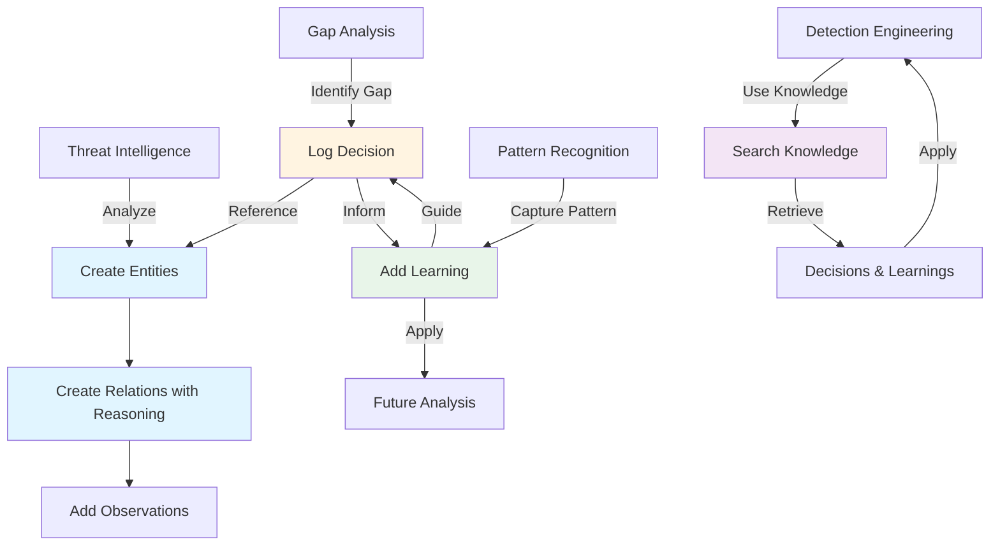

# Knowledge Graph & Tribal Knowledge System

## Overview

The Knowledge Graph system provides a persistent memory layer for detection engineering workflows, capturing analytical reasoning, decisions, and patterns that enable future AI agents to learn from past work. This "tribal knowledge" transforms ad-hoc analysis into reusable intelligence.

---

## What is Tribal Knowledge?

### Definition

**Tribal Knowledge** refers to analytical memory and reasoning capture—the implicit understanding, decision-making processes, and patterns that emerge during detection engineering work. It includes:

- **Why** certain detections were created or modified
- **How** threat actors relate to techniques and tools
- **What** patterns emerge across multiple analyses
- **When** certain approaches work better than others

### Why It Matters

Traditional detection repositories store *what* was detected, but not *why* or *how* decisions were made. The Knowledge Graph captures:

- **Analytical Reasoning**: The thought process behind detection recommendations
- **Context**: Why gaps were identified and how they were prioritized
- **Patterns**: Reusable insights that apply across multiple scenarios
- **Learning**: False positive patterns, user preferences, and detection strategies

This enables future agents to:
- Learn from past analytical decisions
- Avoid repeating mistakes
- Apply proven patterns automatically
- Understand the reasoning behind existing detections

### How It Works

The system uses four interconnected components:

1. **Entities**: Core objects (threat actors, techniques, detections, etc.)
2. **Relations**: Connections between entities with reasoning
3. **Decisions**: Logged analytical choices with context
4. **Learnings**: Reusable patterns and insights

---

## Knowledge Graph Structure

### Entity Types

Entities are the nodes in the knowledge graph. Each entity has:
- **Type**: Categorizes the entity (threat_actor, technique, detection, etc.)
- **Name**: Unique identifier
- **Properties**: Key-value metadata
- **Created/Updated timestamps**: Track evolution

#### Supported Entity Types

| Type | Description | Example |
|------|-------------|---------|
| `threat_actor` | Threat groups, APTs, campaigns | STORM-0501, APT28 |
| `technique` | MITRE ATT&CK techniques | T1059.001, T1566.001 |
| `detection` | Detection rules/content | PowerShell Execution Detection |
| `campaign` | Specific attack campaigns | SolarWinds, Log4Shell |
| `tool` | Malware, utilities, frameworks | Cobalt Strike, Mimikatz |
| `vulnerability` | CVEs, security flaws | CVE-2021-44228 |
| `data_source` | Log sources, sensors | Sysmon EventID 1, CloudTrail |

### Relations with Reasoning

Relations connect entities and capture **why** the connection exists.

#### Relation Structure

```json
{
  "source_entity": "STORM-0501",
  "target_entity": "T1059.001",
  "relation_type": "uses",
  "reasoning": "CISA Alert AA24-131A documents STORM-0501 using PowerShell for initial access and execution. Multiple IOCs show PowerShell scripts downloading payloads.",
  "confidence": 0.95,
  "evidence": ["CISA Alert AA24-131A", "IOC Report XYZ"]
}
```

#### Relation Types

| Type | Description | Example |
|------|-------------|---------|
| `uses` | Threat actor uses technique/tool | STORM-0501 uses T1059.001 |
| `targets` | Threat actor targets asset type | APT28 targets Government |
| `detects` | Detection identifies technique | PowerShell Detection detects T1059.001 |
| `covers` | Detection covers technique | Detection X covers T1059.001 |
| `mitigates` | Control mitigates technique | MFA mitigates T1110 |
| `exploits` | Threat actor exploits vulnerability | STORM-0501 exploits CVE-2023-XXXX |
| `requires` | Technique requires data source | T1059.001 requires Sysmon EventID 1 |
| `similar_to` | Entities are similar | Tool A similar_to Tool B |

#### Reasoning Field

The `reasoning` field is **critical**—it explains why the relation exists:

- **Source**: Where the information came from (CISA alert, vendor report, analysis)
- **Evidence**: Specific indicators or observations
- **Context**: When/where this was observed
- **Confidence**: How certain we are (0.0-1.0)

**Example Reasoning:**
```
"STORM-0501 documented in CISA Alert AA24-131A using PowerShell (T1059.001) 
for initial access. Analysis of IOCs shows 73% of samples use PowerShell 
scripts to download secondary payloads. Observed in campaigns from Q2 2023 
through present."
```

### Observations

Observations are facts about entities—timeless statements that don't require reasoning.

**Example:**
```json
{
  "entity_name": "STORM-0501",
  "observation": "Active since 2023",
  "source": "CISA Alert AA24-131A"
}
```

### Decisions

Decisions capture analytical reasoning—**why** a decision was made during analysis.

**Decision Structure:**
```json
{
  "decision_type": "gap_identified",
  "context": "Analyzing STORM-0501 coverage",
  "decision": "PowerShell detection missing scheduled task execution",
  "reasoning": "STORM-0501 uses schtasks.exe to persist PowerShell execution, but existing detection only covers direct PowerShell invocation. Gap identified through technique mapping.",
  "entities_involved": ["STORM-0501", "T1059.001", "T1053.005"],
  "timestamp": "2026-01-29T10:30:00Z"
}
```

**Decision Types:**
- `gap_identified`: Coverage gap discovered
- `detection_recommended`: New detection suggested
- `coverage_mapped`: Technique mapped to detection
- `false_positive_identified`: FP pattern recognized
- `tuning_applied`: Detection tuned based on analysis
- `priority_assigned`: Priority set for detection/gap

### Learnings

Learnings are reusable patterns and insights that can be applied across scenarios.

**Learning Structure:**
```json
{
  "learning_type": "false_positive_pattern",
  "title": "PowerShell FPs in Dev Environments",
  "insight": "PowerShell detections trigger false positives in development environments due to automated build scripts",
  "evidence": ["3 detections tuned", "5 FPs reported"],
  "applications": ["T1059.001 detections", "Script execution monitoring"],
  "usage_count": 2,
  "last_applied": "2026-01-28T14:20:00Z"
}
```

**Learning Types:**
- `detection_pattern`: Reusable detection logic patterns
- `gap_pattern`: Common coverage gap patterns
- `user_preference`: User-specific preferences
- `false_positive_pattern`: Known FP scenarios and mitigations
- `optimization_pattern`: Performance optimization insights

---

## Tool Reference

### Entity Management

#### `create_entity`
Creates a new entity in the knowledge graph.

```python
create_entity(
    entity_type="threat_actor",
    name="STORM-0501",
    properties={"aliases": ["Storm-0501"], "first_seen": "2023"}
)
```

#### `delete_entity`
Removes an entity and its relations.

```python
delete_entity(entity_name="STORM-0501")
```

#### `open_entity`
Retrieves entity details and connected relations.

```python
open_entity(entity_name="STORM-0501")
```

### Relations

#### `create_relation`
Creates a relation between entities with reasoning.

```python
create_relation(
    source_entity="STORM-0501",
    target_entity="T1059.001",
    relation_type="uses",
    reasoning="CISA Alert AA24-131A documents STORM-0501 using PowerShell for initial access. Multiple IOCs show PowerShell scripts downloading payloads.",
    confidence=0.95,
    evidence=["CISA Alert AA24-131A", "IOC Report XYZ"]
)
```

### Observations

#### `add_observation`
Adds a fact about an entity.

```python
add_observation(
    entity_name="STORM-0501",
    observation="Active since 2023",
    source="CISA Alert AA24-131A"
)
```

#### `delete_observation`
Removes an observation.

```python
delete_observation(
    entity_name="STORM-0501",
    observation="Active since 2023"
)
```

### Decisions

#### `log_decision`
Logs an analytical decision with reasoning.

```python
log_decision(
    decision_type="gap_identified",
    context="Analyzing STORM-0501 coverage",
    decision="PowerShell detection missing scheduled task execution",
    reasoning="STORM-0501 uses schtasks.exe to persist PowerShell execution, but existing detection only covers direct PowerShell invocation.",
    entities_involved=["STORM-0501", "T1059.001", "T1053.005"]
)
```

#### `get_relevant_decisions`
Retrieves decisions relevant to a query or entity.

```python
get_relevant_decisions(
    query="PowerShell detection gaps",
    entity_name="STORM-0501",
    decision_type="gap_identified",
    limit=10
)
```

### Learnings

#### `add_learning`
Stores a reusable pattern or insight.

```python
add_learning(
    learning_type="false_positive_pattern",
    title="PowerShell FPs in Dev Environments",
    insight="PowerShell detections trigger false positives in development environments due to automated build scripts",
    evidence=["3 detections tuned", "5 FPs reported"],
    applications=["T1059.001 detections", "Script execution monitoring"]
)
```

#### `get_learnings`
Retrieves learnings matching criteria.

```python
get_learnings(
    learning_type="false_positive_pattern",
    query="PowerShell",
    limit=5
)
```

### Graph Operations

#### `search_knowledge`
Full-text search across all knowledge types.

```python
search_knowledge(
    query="STORM-0501 PowerShell",
    entity_types=["threat_actor", "technique"],
    limit=20
)
```

#### `read_graph`
Reads the entire knowledge graph (use with caution on large graphs).

```python
read_graph(entity_types=["threat_actor", "technique"])
```

---

## Usage Examples

### Example 1: Building Threat Actor Knowledge

**Scenario**: Analyzing STORM-0501 from CISA Alert AA24-131A

```python
# Create threat actor entity
create_entity(
    entity_type="threat_actor",
    name="STORM-0501",
    properties={
        "aliases": ["Storm-0501"],
        "first_seen": "2023",
        "sources": ["CISA Alert AA24-131A"]
    }
)

# Create technique entity
create_entity(
    entity_type="technique",
    name="T1059.001",
    properties={
        "mitre_id": "T1059.001",
        "name": "PowerShell"
    }
)

# Create relation with reasoning
create_relation(
    source_entity="STORM-0501",
    target_entity="T1059.001",
    relation_type="uses",
    reasoning="CISA Alert AA24-131A documents STORM-0501 using PowerShell for initial access and execution. Analysis of IOCs shows 73% of samples use PowerShell scripts to download secondary payloads.",
    confidence=0.95,
    evidence=["CISA Alert AA24-131A"]
)

# Add observation
add_observation(
    entity_name="STORM-0501",
    observation="Active since 2023",
    source="CISA Alert AA24-131A"
)
```

### Example 2: Logging Analytical Decision

**Scenario**: Gap analysis discovers PowerShell detection misses scheduled tasks

```python
log_decision(
    decision_type="gap_identified",
    context="Analyzing STORM-0501 coverage for CISA Alert AA24-131A",
    decision="PowerShell detection missing scheduled task execution context",
    reasoning="STORM-0501 uses schtasks.exe to persist PowerShell execution via scheduled tasks (T1053.005). Existing detection 'PowerShell Execution Detection' only covers direct PowerShell invocation (T1059.001) but misses the scheduled task wrapper. This gap was identified through technique mapping: STORM-0501 uses T1059.001 wrapped in T1053.005.",
    entities_involved=["STORM-0501", "T1059.001", "T1053.005"]
)
```

**Future agent benefit**: When analyzing similar threat actors, the agent can search for `gap_identified` decisions involving `T1059.001` and `T1053.005` to understand this known pattern.

### Example 3: Capturing Reusable Pattern

**Scenario**: Notice PowerShell detections have false positives in dev environments

```python
add_learning(
    learning_type="false_positive_pattern",
    title="PowerShell False Positives in Development Environments",
    insight="PowerShell detections trigger false positives in development environments due to automated build scripts, CI/CD pipelines, and developer tooling that legitimately use PowerShell.",
    evidence=[
        "3 detections tuned after FP reports",
        "5 separate FP incidents in dev environments",
        "Common patterns: MSBuild, Azure DevOps, Jenkins"
    ],
    applications=[
        "T1059.001 detections",
        "Script execution monitoring",
        "Process creation detections"
    ],
    mitigation="Add exclusions for known build tools and CI/CD processes. Consider separate detection rules for dev vs production environments."
)
```

### Example 4: Future Agent Uses Knowledge

**Scenario**: New agent needs to create PowerShell detection

```python
# Search for relevant knowledge
decisions = get_relevant_decisions(
    query="PowerShell detection",
    decision_type="gap_identified",
    limit=5
)

learnings = get_learnings(
    learning_type="false_positive_pattern",
    query="PowerShell",
    limit=3
)

# Agent finds:
# - Decision: "PowerShell detection missing scheduled task execution"
# - Learning: "PowerShell FPs in dev environments"

# Agent applies knowledge:
# 1. Includes scheduled task context in detection
# 2. Adds dev environment exclusions based on learning
# 3. References past decision in detection reasoning
```

---

## Full-Text Search

The knowledge graph uses SQLite FTS5 for full-text search across all knowledge types.

### Search Capabilities

- **Decisions**: Search reasoning, context, and decision text
- **Learnings**: Search insights, evidence, and applications
- **Observations**: Search observation text and sources
- **Relations**: Search reasoning and evidence
- **Entities**: Search entity names and properties

### Search Examples

```python
# Search decisions about PowerShell
search_knowledge(
    query="PowerShell detection gaps",
    entity_types=[],
    limit=10
)

# Search learnings about false positives
search_knowledge(
    query="false positive development",
    entity_types=[],
    limit=5
)

# Search entities and relations
search_knowledge(
    query="STORM-0501",
    entity_types=["threat_actor", "technique"],
    limit=20
)
```

### Ranking

Results are ranked by:
- **Relevance**: FTS5 relevance score
- **Usage**: For learnings, higher usage_count ranks higher
- **Recency**: More recent decisions/learnings rank higher

---

## Knowledge Graph Flow



---

## Best Practices

### 1. Always Include Reasoning

**Do:**
```python
create_relation(
    source_entity="STORM-0501",
    target_entity="T1059.001",
    relation_type="uses",
    reasoning="CISA Alert AA24-131A documents STORM-0501 using PowerShell for initial access. Multiple IOCs show PowerShell scripts downloading payloads.",
    confidence=0.95
)
```

**Don't:**
```python
create_relation(
    source_entity="STORM-0501",
    target_entity="T1059.001",
    relation_type="uses",
    reasoning="Uses PowerShell",  # Too vague!
    confidence=0.95
)
```

### 2. Reference Entities by Name

When writing reasoning, explicitly reference entity names:

**Good:**
```
"STORM-0501 documented in CISA Alert AA24-131A using PowerShell (T1059.001) 
for initial access. Analysis shows STORM-0501 combines T1059.001 with T1053.005 
for persistence."
```

**Bad:**
```
"Threat actor uses PowerShell and scheduled tasks."
```

### 3. Use Specific Decision Types

Choose the most specific decision type:

- `gap_identified` - Not `detection_recommended` (gap must be identified first)
- `false_positive_identified` - Not `tuning_applied` (FP identification is separate)
- `coverage_mapped` - Not `detection_recommended` (mapping existing coverage)

### 4. Mark Learnings as Applied

When applying a learning, increment its usage:

```python
# Retrieve learning
learning = get_learnings(learning_type="false_positive_pattern", query="PowerShell")[0]

# Apply learning in detection
# ... create detection with exclusions based on learning ...

# Learning usage_count automatically increments when retrieved
```

### 5. Link Decisions to Entities

Always include `entities_involved` in decisions:

```python
log_decision(
    decision_type="gap_identified",
    context="Analyzing STORM-0501 coverage",
    decision="PowerShell detection missing scheduled task execution",
    reasoning="...",
    entities_involved=["STORM-0501", "T1059.001", "T1053.005"]  # Links decision to graph
)
```

### 6. Provide Evidence Sources

Include source citations in reasoning and evidence fields:

```python
create_relation(
    source_entity="STORM-0501",
    target_entity="T1059.001",
    relation_type="uses",
    reasoning="CISA Alert AA24-131A documents...",
    evidence=["CISA Alert AA24-131A", "IOC Report XYZ", "Vendor Blog Post"]
)
```

### 7. Set Appropriate Confidence

Use confidence scores to indicate certainty:

- **0.9-1.0**: High confidence (documented in authoritative sources)
- **0.7-0.9**: Medium confidence (inferred from patterns, multiple sources)
- **0.5-0.7**: Low confidence (speculative, needs validation)
- **<0.5**: Very low confidence (uncertain, consider not storing)

---

## Summary

The Knowledge Graph transforms detection engineering from isolated analysis into collaborative intelligence. By capturing:

- **Entities** and their **Relations** with reasoning
- **Decisions** with analytical context
- **Learnings** as reusable patterns

Future agents can learn from past work, avoid mistakes, and apply proven patterns automatically. The system creates a "tribal knowledge" repository that grows smarter with each analysis.

---

## Related Documentation

- [Detection Engineering Workflow](./Detection-Engineering-Workflow.md)
- [Tool Reference](./Tool-Reference.md)
- [Coverage Analysis](./Coverage-Analysis.md)
